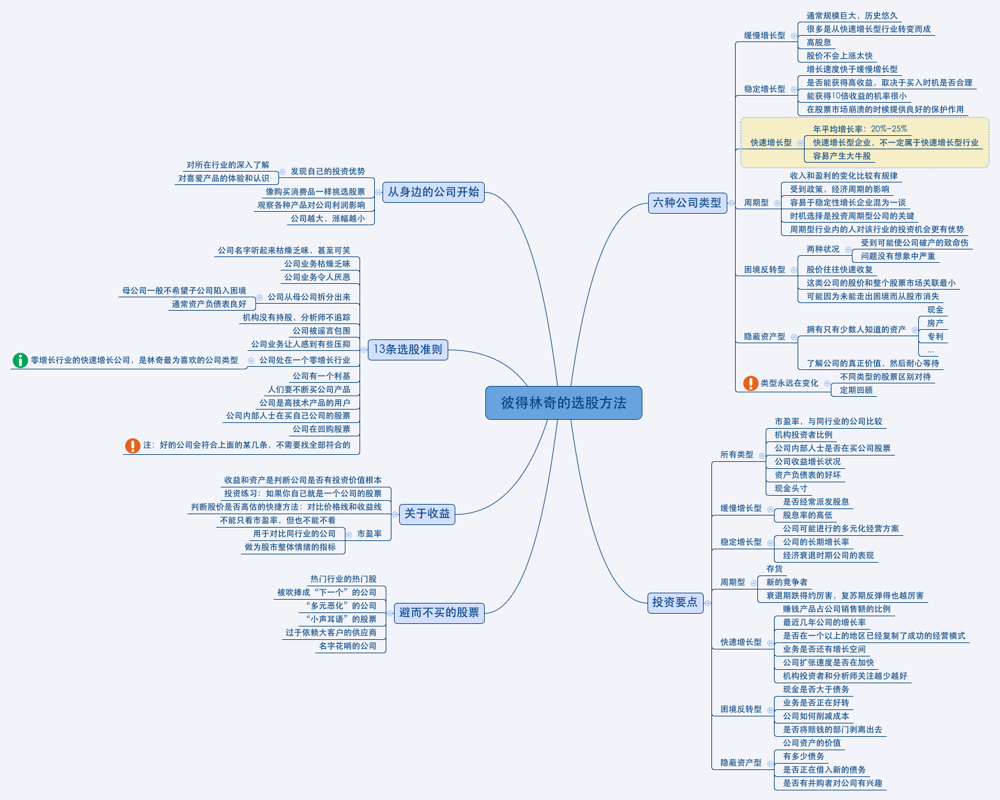

+++
date = '2015-09-03T11:38:27+08:00'
type = 'blog'
draft = false
title = '彼得・林奇的成功投资'
tags = ["mindmap", "trading"]
categories = ["闻"]
+++

前些时间读完林奇的 *One Up on Wall Street* ，做了个思维导图。

不知道能不能把这些东西量化呢？
